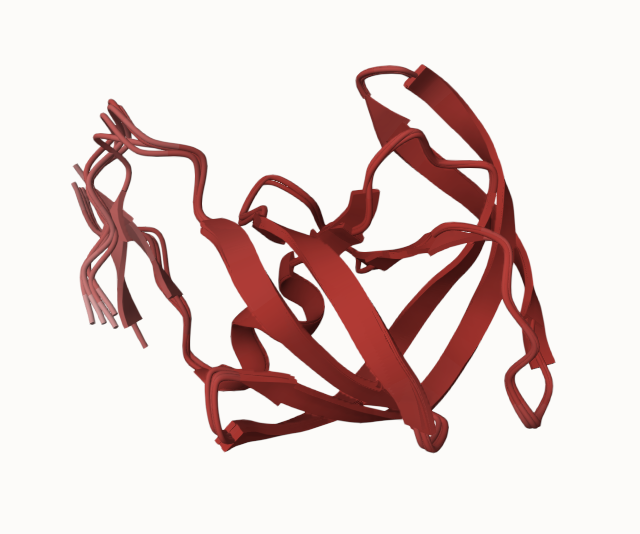
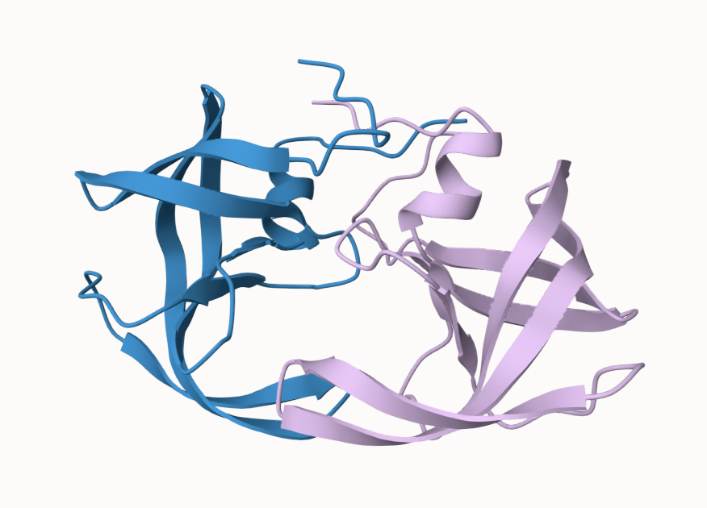

## Overview 

In this lab, we used AlphaFold2 via ColabFold to predict the structure of HIV Protease (HIV-Pr), first as a monomer and then as a homodimer. We analyzed the resulting models using Bio3D in R, examining structural consistency, confidence scores (pLDDT), predicted aligned error (PAE), and residue conservation.

## Section 8: Custom Analysis of AlphaFold Dimer Models

All analysis below uses the HIV-Pr homodimer ColabFold results (`HIV_Pr_dimer_23119/`).

### Loading PDB Files

```{r}
library(bio3d)

# 1. Load files
results_dir <- "HIV_Pr_dimer_23119/"
pdb_files <- list.files(path=results_dir, pattern="*.pdb", full.names=TRUE)
basename(pdb_files)
```

### Aligning and Fitting Models

```{r}
# 2. Align and fit
pdbs <- pdbaln(pdb_files, fit=TRUE, exefile="msa")
pdbs
```

The alignment shows 5 sequence rows with 198 position columns (99 residues × 2 chains), with no gaps since all models have identical sequences.

### RMSD Analysis

RMSD (Root Mean Square Deviation) measures structural distance between coordinate sets.

```{r}
# 3. RMSD matrix
rd <- rmsd(pdbs, fit=T)
range(rd)

# 4. RMSD heatmap
library(pheatmap)
colnames(rd) <- paste0("m",1:5)
rownames(rd) <- paste0("m",1:5)
pheatmap(rd)
```

The heatmap shows that models 1 and 2 are structurally similar to each other, while models 4 and 5 are quite different — consistent with their lower average pLDDT scores (76.57 and 72.98 respectively).

### pLDDT Scores Across Models

pLDDT (predicted local distance difference test) is a per-residue confidence score ranging from 0–100. Values above 70 are considered reliable; below 50 are unreliable.

```{r}
# 5. pLDDT plot
pdb <- read.pdb("1hsg")
plotb3(pdbs$b[1,], typ="l", lwd=2, sse=pdb)
points(pdbs$b[2,], typ="l", col="red")
points(pdbs$b[3,], typ="l", col="blue")
points(pdbs$b[4,], typ="l", col="darkgreen")
points(pdbs$b[5,], typ="l", col="orange")
abline(v=100, col="gray")
legend("bottomleft", legend=paste0("m",1:5),
       col=c("black","red","blue","darkgreen","orange"), lty=1)
```

The vertical gray line at position 100 marks the boundary between chain A and chain B. Models 1–3 maintain high pLDDT throughout, while models 4 and 5 show notably lower confidence, particularly in chain B.

### Core Superposition

To improve structural comparison, we identify the most consistent rigid core across all models.

```{r}
# 6. Core superposition
core <- core.find(pdbs)
core.inds <- print(core, vol=0.5)
xyz <- pdbfit(pdbs, core.inds, outpath="corefit_structures")
```

### RMSF Analysis

RMSF (Root Mean Square Fluctuation) measures positional variability across models at each residue.

```{r}
# 7. RMSF
rf <- rmsf(xyz)
plotb3(rf, sse=pdb)
abline(v=100, col="gray", ylab="RMSF")
```

Chain A (positions 1–99) is largely consistent across models. Chain B (positions 100–198) shows much greater variability, indicating that the second chain is less reliably predicted — a known limitation of AlphaFold monomer-based dimer modeling.

### Predicted Aligned Error (PAE)

PAE measures confidence in the relative position of pairs of residues. Low PAE = high confidence.

```{r}
# 8. PAE from JSON files
library(jsonlite)
pae_files <- list.files(path=results_dir, pattern=".*model.*\\.json", full.names=TRUE)
pae1 <- read_json(pae_files[1], simplifyVector=TRUE)
pae5 <- read_json(pae_files[5], simplifyVector=TRUE)
```

```{r}
# Per-residue pLDDT scores 
#  same as B-factor of PDB..
head(pae1$plddt)
```

```{r}
# Maximum PAE values (lower = better)
pae1$max_pae
pae5$max_pae
```

Model 1 has a much lower max PAE than model 5, confirming it is the higher quality prediction.

```{r}
plot.dmat(pae1$pae, 
          xlab="Residue Position (i)",
          ylab="Residue Position (j)")
```

```{r}
plot.dmat(pae5$pae, 
          xlab="Residue Position (i)",
          ylab="Residue Position (j)",
          grid.col = "black",
          zlim=c(0,30))
```

```{r}
plot.dmat(pae1$pae, 
          xlab="Residue Position (i)",
          ylab="Residue Position (j)",
          grid.col = "black",
          zlim=c(0,30))
```

Model 1's PAE plot shows clear off-diagonal dark blocks, indicating confident inter-domain packing between the two chains. Model 5 shows a more uniform (lighter) matrix, indicating poor confidence in the relative positioning of the two chains.

### Residue Conservation

We read the MSA generated by ColabFold and score conservation at each position.

```{r}
# 9. Residue conservation
aln_file <- list.files(path=results_dir,
                       pattern=".a3m$",
                        full.names = TRUE)
aln_file
```

```{r}
aln <- read.fasta(aln_file[1], to.upper = TRUE)
```

```{r}
dim(aln$ali)
```

```{r}
sim <- conserv(aln)
plotb3(sim[1:99], sse=trim.pdb(pdb, chain="A"),
       ylab="Conservation Score")
```

```{r}
con <- consensus(aln, cutoff = 0.9)
con$seq
```

The consensus sequence highlights the conserved active site residues **D25, T26, G27, A28** (the DTGA motif), which are critical for HIV protease catalytic activity.

### Writing Conservation to PDB for Mol\* Visualization

```{r}
# 10. Write conservation PDB for Mol*
m1.pdb <- read.pdb(pdb_files[1])
occ <- vec2resno(c(sim[1:99], sim[1:99]), m1.pdb$atom$resno)
write.pdb(m1.pdb, o=occ, file="m1_conserv.pdb")
```

## Mol\* Visualizations

The following figures were generated in Mol\* using the ColabFold dimer PDB output files.

### Figure 18: Superposed Dimer Models Colored by pLDDT



### Figure 19: Core-Fitted Structures Colored by pLDDT


### Figure 20: Top Model Colored by Sequence Conservation



## Session Info

```{r}
sessionInfo()
```

## References

Jumper, J. et al. (2021). Highly accurate protein structure prediction with AlphaFold. *Nature*, 596, 583–589.

Mirdita, M. et al. (2022). ColabFold: Making protein folding accessible to all. *Nature Methods*, 19, 679–682.

Baek, M. et al. (2021). Accurate prediction of protein structures and interactions using a three-track neural network. *Science*, 373, 871–876.
